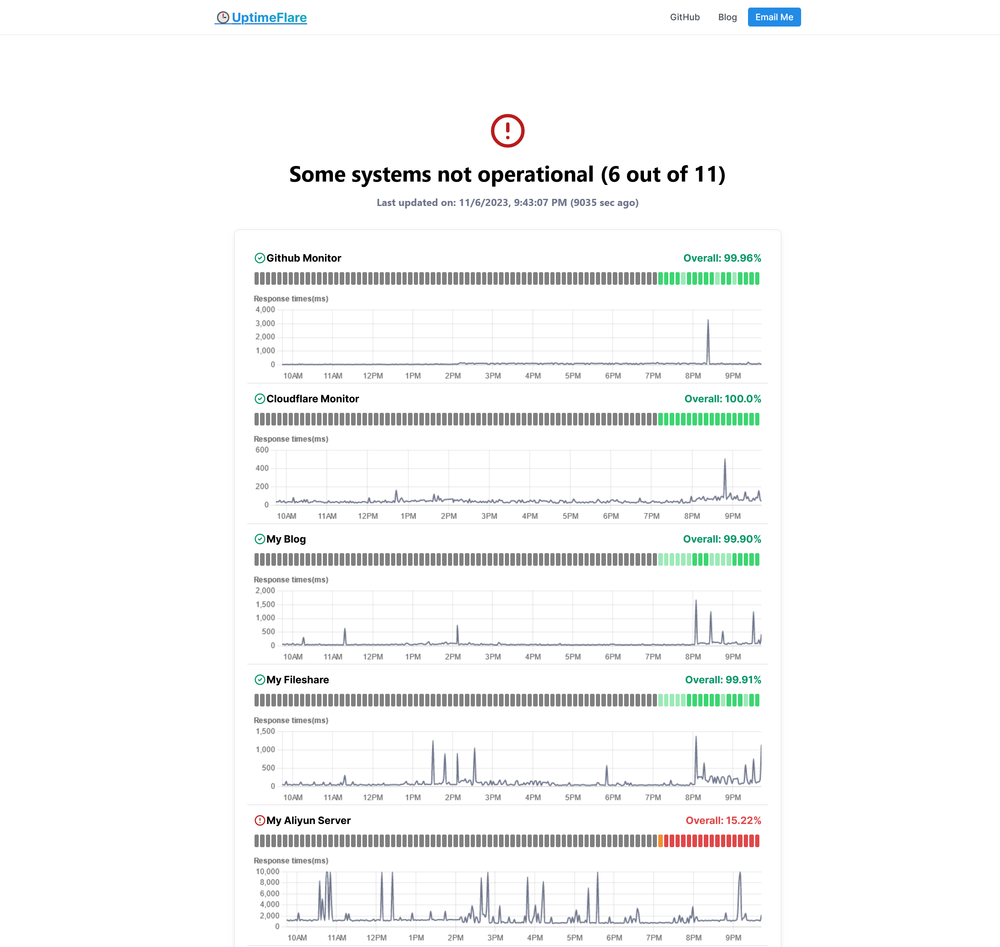

  
  

# ✔[UptimeFlare](https://github.com/lyc8503/UptimeFlare)

一个由 Cloudflare Workers 驱动的功能丰富、Serverless 且免费的 Uptime 监控及状态页面。

## ⭐功能

- 开源，易于部署（全程无需本地工具，耗时不到 10 分钟），且完全免费
- 监控功能
  - 最多支持 50 个 1 分钟精度的检查
  - 支持指定全球 [310+ 个城市](https://www.cloudflare.com/network/) 的监控节点
  - 支持 HTTP/HTTPS/TCP 端口监控
  - 最多 90 天的 uptime 历史记录和 uptime 百分比跟踪
  - 可自定义的 HTTP(s) 请求方法、头和主体
  - 可自定义的 HTTP(s) 状态码和关键字检查
  - 支持 [100 多个通知渠道](https://github.com/caronc/apprise/wiki) 的宕机消息通知
  - 可自定义的 Webhook
- 状态页面
  - 所有类型监控的交互式 ping（响应时间）图表
  - 响应式 UI，自适应PC/手机屏幕，及亮色/暗色系统主题
  - 配置选项丰富的状态页面
  - 可使用您自己的域名与 CNAME
  - 可选的密码认证（私人状态页面）
  - 用于获取实时状态数据的 JSON API

## 👀演示

我自己的状态页面（在线演示）：https://uptimeflare.pages.dev/

一些截图：

## ⚡快速入门 / 📄文档

请参阅 [Wiki](https://github.com/lyc8503/UptimeFlare/wiki)
